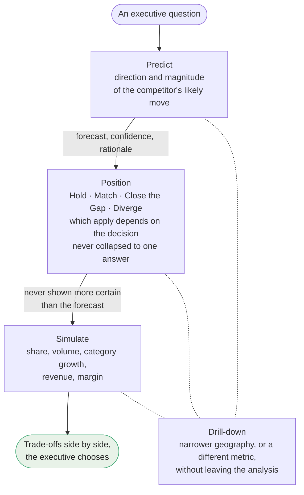
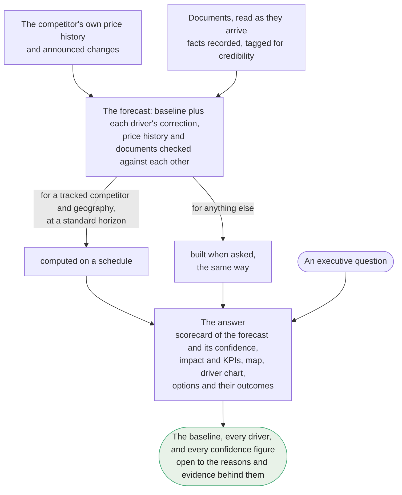
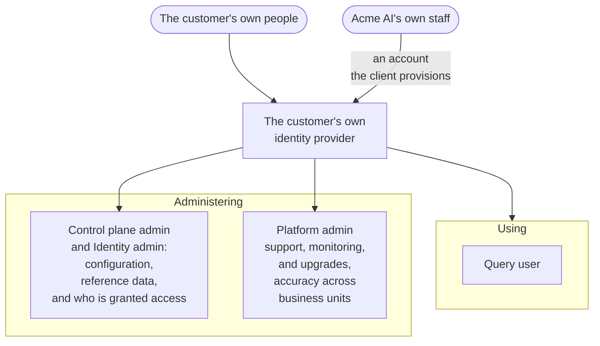
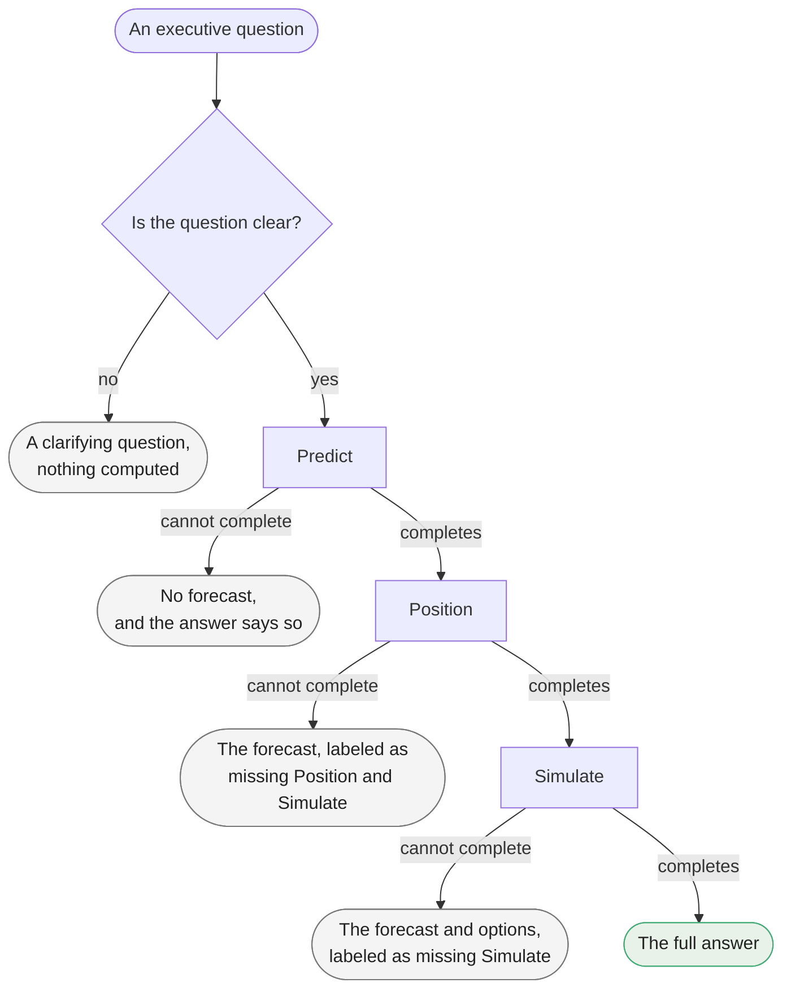

---
technical-specs:
  - specs/application/technical/architecture.md
  - specs/application/technical/engineering-and-production-considerations.md
  - specs/application/technical/identity-and-access.md
---

A single PriceHorizon installation can host several business units side by side, each with its own brand, competitor set, category, and geography, and each with its own glossary terms and thresholds. Business unit is the unit almost everything below is scoped to, the answers a person may ask for, the configuration they may change, and the records they may see.

## Answer Engine

PriceHorizon answers one executive question, what will a competitor do on price, where should Brand A sit in response, and what happens to the business as a result, through capabilities that compose in a fixed order, plus one lens that cuts across all of them. Each question is asked in a decision context, the kind of decision the Query user is working on and the business unit they are working in, asked for when their session starts, the business unit only where they have more than one, shown with every answer and changeable where it is shown; a question's own words can override it for that question alone (`specs/application/product/answer-engine/decision-context.md § Decision Context`).

The price being forecast is effective price, the net price actually realized, list price minus trade promotions and rebates plus any surcharges, per unit over the period being asked about, which is why a competitor's price can move materially while their shelf tag does not.

**Predict** turns the question into a forecast: the direction and magnitude of the competitor's likely move in effective price, always delivered with a plain-language rationale and distinct measures of certainty attached, never a bare number. It arrives as a scorecard of the forecast and its confidence, a plain-language account of the expected impact and the KPIs it moves, a map of how the figure breaks down from country to metro, and a chart of the baseline and the drivers behind it. A confidence band gives the range around the forecast itself, drawn from how much uncertainty the underlying forecasting models carry; a confidence score is a separate read of how well-founded the evidence behind it is, explained under `§ Trust & Explainability`. The two can diverge without contradicting each other, a precise forecast resting on a weakly sourced fact, and the answer shows both without flagging either as an error. Nothing downstream exists without Predict: Position and Simulate both take its output as their own starting point. A positioning option carries the forecast's own confidence unchanged, while a simulated outcome computes its own, since projecting a business outcome introduces uncertainty the forecast never carried. A positioning option built on a low-confidence forecast is flagged as such, never presented with false certainty.

**Position** takes Predict's forecast and frames Brand A's response, not as a single recommendation but as a small, named set of options, Hold, Match, Close the Gap, and Diverge, each stated as a price gap and a relative price index against the predicted outcome: the plain currency difference, in the geography's own local currency, never blended into one converted total across countries, and the same comparison expressed as a ratio times 100, where above 100 means Brand A sits at a premium and below it a discount. Which options appear depends on the kind of decision the question is asked for, a brand pricing decision or a retailer or promotional one: a retailer or promotional decision drops Diverge, since Diverge moves the brand's price position, which such a decision does not own. The set is deliberately never collapsed to one answer; the choice belongs to the executive, the system's job is to frame it, not make it.

**Simulate** takes each Position option and projects what it would actually do to the business, share, volume, category growth, revenue, and margin, shown side by side so the trade-off between options is visible before a decision is made, not discovered afterward.

**Drill-down** is not a capability of its own, it is a lens available within every capability: a narrower geography, or a different metric, without leaving the analysis or re-asking the question. Within the range the underlying competitor data supports, a drilled figure is guaranteed consistent with the broader figure it was drilled from. Past that range it becomes a labeled allocation rather than a sourced forecast, and carries no decomposition of its own, since an allocated figure has no causal story to tell; that boundary reflects which competitor data is currently licensed and ingested, not a permanent limit.

Throughout every stage the narrative layer explains numbers that already exist rather than generating new ones, which is what keeps an answer defensible in front of a CFO or a retailer. These capabilities, and the guarantee that no later stage is ever shown as more certain than the stage it was built on (`specs/application/product/trust-and-explainability/guarantees.md § Guarantees This Answer Engine Makes`), are what "the answer" means throughout this product. `§ Diagrams § The Answer` below renders them and how they compose; `§ Diagrams § From Evidence to Answer`, how a forecast is built from its evidence; and `§ Diagrams § When an Answer Falls Short`, what an answer shows when a stage cannot complete. Full detail: `specs/application/product/answer-engine/predict.md`, `specs/application/product/answer-engine/position.md`, `specs/application/product/answer-engine/simulate.md`, `specs/application/product/answer-engine/drill-down.md`, `specs/application/product/answer-engine/decision-context.md`.

## Trust & Explainability

A forecast here is never a magic number. It is built from a baseline, the competitor's own price trend and promotional calendar carried forward and adjusted for anything they have already announced, plus a correction from each driver behind it, sized by the evidence and that driver's versioned weight; the forecast is exactly that sum, and the driver chart shows each part. Most of the evidence is in place before anyone asks: documents are read as they arrive, their facts recorded and tagged with how credible that type of source is, and forecasts are computed on a schedule for every competitor and geography a business unit tracks, at standard horizons; a question outside that set has its forecast built when asked, the same way. When a forecast is built, the price history and the documents are checked against each other, so evidence pointing, by enough to count as a price move, where the baseline does not go is caught rather than averaged away.

The forecast's figures open to their why, without leaving the analysis. The baseline opens to the price history, forecasting models and announcements it was built from, and each driver to the document it came from, or, where it is estimated rather than reported, the model that produced it, or both. A figure estimated below the geography the data reports opens to the figure it was allocated from and the weighting used. Every confidence figure opens to the reasons it sits where it does: for a forecast, and the options built on it, how credible the weakest source is, how current the data is, and whether the evidence agrees, naming both sides of any disagreement big enough to count as a price move; for a simulated outcome, how confident and how recently validated its models are, and whether it was held down to the forecast's own confidence. Each reason opens to the evidence behind it. This is where tracing every number to a named source stops being an assertion and becomes something a Query user can check, and where an executive sees not just the number but why to believe it, or why not yet. `§ Diagrams § From Evidence to Answer` below pictures this.

An answer a Query user can act on has to survive being questioned afterward, by the executive themselves, by a CFO, by a retailer across the table. These guarantees make that possible: the same question reproduces the same substance, every figure and score, though the narrative's wording may differ, as long as nothing has changed in between, neither the data nor the application, model, or configuration versions behind it, nor the kind of decision it is asked for, every number traces back to a named, versioned model or dataset rather than being asserted on faith, qualitative context, a regulatory change, a competitor's own stated plan, is weighed into the forecast rather than bolted on afterward as commentary, and every number shows how it was built and why to believe it. This is a different concern from whether the models are drifting over time, that is `§ Accuracy Governance` below, and a different concern from who accessed the system or how it executed a request, that is `§ System Records` below; Trust & Explainability is specifically about whether the answer in front of a Query user right now can be trusted. Fallbacks hold those guarantees up at the edges. A question whose own terms cannot be resolved, or that leaves unclear which business unit or kind of decision it is about, returns a clarifying question rather than a guess, and nothing is computed for it. A forecast whose evidence falls below the confidence threshold is labeled as such rather than stated fluently. A stage that cannot complete after the answer is under way says so plainly and shows whatever earlier stages did complete, or, where nothing completed, says that instead; a stale or guessed figure is never substituted in any of these cases. `§ Diagrams § When an Answer Falls Short` below pictures this. Full detail: `specs/application/product/trust-and-explainability/guarantees.md`, `specs/application/product/trust-and-explainability/degraded-answer-behavior.md`, `specs/application/product/answer-engine/predict.md`, `specs/application/product/answer-engine/simulate.md`.

## Accuracy Governance

Separately from any single answer's own defensibility, every forecast is eventually checked against what actually happened once its horizon passes, not to grade a decision an executive already made, but to tell whether the underlying models themselves are drifting as markets shift. This is one mechanism visible at different scopes: a Platform admin sees, across every business unit an installation hosts, every driver signal used, the forecasts those signals fed, and whether each forecast turned out Right, Right direction, or Wrong, and by how far, the pattern Acme AI actually tunes archetype rules, model versions, and weighting rubrics against, and a Control plane admin sees the same view scoped to their own business unit, with the ability to escalate a pattern that looks like the platform itself rather than their own business unit's own reality, and to raise a specific prediction with the Query user who asked it. A verdict is judged against what the forecast committed to when it was made, so a later settings change never rewrites it. Full detail: `specs/application/product/accuracy-governance.md`.

## Tenant Administration

A self-service control plane lets a client manage the day-to-day realities of running PriceHorizon without needing Acme AI paged for routine changes: adding a business unit, retiring a competitor, recording a rebrand without losing its pricing history, connecting a new data source Acme AI has already built support for, registering the business unit's own wording for a term the product already governs, so local jargon resolves the way the standard term does, setting the business unit's own thresholds for when a price counts as moving and when two options are close enough to show as one, renaming how its options are labeled, and resolving the handful of cases the system itself flags as uncertain or incomplete, a product match, a document extraction, since the client's own analysts know their catalog and market better than anyone outside the business unit. A threshold change reaches the very next answer, except that a forecast computed on a schedule picks up a new stable-price threshold only when it is next computed; a Control plane admin can ask for the business unit's scheduled forecasts to be computed again rather than waiting for the next run. The same self-service surface is also where a Control plane admin sees who has done what within their own business unit at any time, Acme AI's own access through PriceHorizon's own systems, every configuration change made to the business unit and who made it, every change to who has access to it, every change to who holds the Platform admin role, and their own Query users' questions and what they were told, and where they can temporarily raise how much debugging detail PriceHorizon's application logs capture for their own business unit, when they are experiencing an issue and want it resolved faster. The audit record can be searched by who acted, what kind of action, and when, and exported as exactly the filtered set, with the narrative wording and figures themselves left behind, so a compliance reviewer can be handed it without needing access of their own. What stays with Acme AI is the forecasting mechanism itself and the governed vocabulary, which change only through an application or model release; the bounds on every threshold; and how long the audit log is kept, which a Control plane admin can see but not change. Full detail: `specs/application/product/tenant-administration/reference-data-management.md`, `specs/application/product/tenant-administration/business-unit-settings.md`, `specs/application/product/tenant-administration/data-source-connections.md`, `specs/application/product/tenant-administration/review-queues.md`, `specs/application/product/tenant-administration/audit-log-visibility.md`, `specs/application/product/tenant-administration/application-log-control.md`.

## Identity & Access

PriceHorizon's roles distinguish everyday use from administration. A Query user asks questions and explores the answer, in whichever business units their identity grants. A Control plane admin manages a business unit's own configuration, reference data, thresholds and review queues, reviews its forecast evidence and accuracy, and sees the record of who has done what within it, scoped to that business unit alone. An Identity admin maps the customer's own identity claims to business units and roles, across the whole installation rather than the business units a person is granted, since a mistake there could affect access across all of them, and sees the record of every such change; the Platform admin described under `§ Platform & Compliance Operations` likewise works across every business unit an installation hosts.

The customer's own people sign in through their own identity provider, over OIDC or SAML, so there is no separate PriceHorizon login to learn or run. The identity provider asserts which business units each of them may query and which role they hold, and a claim grants nothing until an Identity admin maps it. How Acme AI's own staff reach an installation is `§ Platform & Compliance Operations`.

PriceHorizon keeps using it and administering it on architecturally separate paths, rather than relying on a permissions setting alone. A security-conscious buyer should be able to know not just who can ask a pricing question, but who can change what a competitor's code means or edit a threshold, and whether those two populations are ever the same path by accident. They are not: the service that answers questions never holds the credentials to change configuration, so a problem in the far more widely used query path has no way to reach the far more sensitive administrative one. This is a principle every role, and every technical service boundary built to enforce it, has to hold to, not a fact specific to any one of them. `§ Diagrams § Using and Administering` below renders this. Full detail, the roles, how access federates to the customer's own identity provider, and how an Identity admin actually grants it, is `specs/application/product/roles.md § Roles`.

## Platform & Compliance Operations

PriceHorizon deploys as a versioned, self-hosted installation inside each customer's own environment, the primary protection for competitively sensitive data being that it never leaves the customer's own infrastructure. The customer's own identity provider sits inside that same environment, and every installation runs entirely within the customer's security boundary, needing no connection outside it, air-gapped where the customer requires; a client raises a support case through Acme AI's own support portal, which PriceHorizon never connects to. Acme AI's own staff hold the Platform admin role, and with it the access needed to support, monitor, and upgrade an installation, itself governed and recorded rather than a blank check, reached through an account the client provisions in its own identity provider or, only where that cannot be reached, local break-glass credentials, and the client can disable it entirely from their own side at any time, without Acme AI's cooperation. Every credential the installation holds lives in an isolated vault, never in the same database as ordinary configuration or reference data. An upgrade is a discrete, versioned, customer-visible event, never a silent change underneath them. The client elects each upgrade; Acme AI never moves an installation to a version they have not. The application and its models upgrade independently of each other, and an elected upgrade is either Acme AI-managed, where Acme AI's own staff execute it, or self-managed, where the client's own infrastructure team applies the release. Which versions are currently running is visible to the client at any time. Onboarding is verified as actually working, real driver signals and forecasts flowing for real questions, before it is treated as done just because integrations are connected. Full detail: `specs/application/product/platform-and-compliance-operations/deployment-topology.md`, `specs/application/product/platform-and-compliance-operations/versioned-upgrades.md`, `specs/application/product/platform-and-compliance-operations/onboarding-verification.md`.

## System Records

PriceHorizon keeps different kinds of record about itself, deliberately never folded into one, each answering a different question for a different audience. The audit log records who did something and when, such as a Query user asking a question, an admin changing a setting, or Acme AI accessing an installation; it is a compliance record, kept for at least a year by default, and a Control plane admin sees their own business unit's activity and installation-wide events such as an upgrade or a change to who holds the Platform admin role, an Identity admin every change to who is granted access and every question refused for lack of any business unit access, and Acme AI its own installation's activity, the client through the self-service surface `§ Tenant Administration` describes. The application log records how the software executed a request internally, which steps ran, how long each took, what failed; it is a debugging record for Acme AI's engineers, with no product screen, kept for weeks rather than years, never carrying the content of a forecast, a document, or a credential, forwarded to the client's own observability system, or, where the client runs none, to an observability viewer shipped alongside PriceHorizon, never sent to anything Acme AI hosts, and never combined with another customer's. Acme AI's engineers see it in the client's system only through access the client grants, outside PriceHorizon and its audit log, and in the viewer through their own governed access, which the audit log records. An answer's own lineage records what one number is made of, which forecast, evidence, model and version produced it; a Query user sees it inside the answer itself, by opening any figure to its why as `§ Trust & Explainability` describes, never in a log. Conflating any two of them, treating an access record as though it explained a number, is exactly the mistake this separation exists to prevent. Full detail: `specs/application/product/logging-and-traceability.md`.

## Diagrams

### The Answer

**Caption:** The capabilities in their fixed order, what each contributes, and Drill-down cutting across all of them.

**Sources:**
- `specs/application/product/answer-engine/drill-down.md § Drill-down — cross-cutting, available at every stage`
- `specs/application/product/answer-engine/position.md § Position — where Brand A should sit`
- `specs/application/product/answer-engine/predict.md § Predict — what will the competitor do`
- `specs/application/product/answer-engine/simulate.md § Simulate — what follows for the business`
- `specs/application/product/trust-and-explainability/guarantees.md § Guarantees This Answer Engine Makes`
- `§ Answer Engine`

### From Evidence to Answer

**Caption:** How a forecast is built from its evidence, and what a Query user can open once the answer arrives.

**Sources:**
- `specs/application/product/answer-engine/position.md § Position — where Brand A should sit`
- `specs/application/product/answer-engine/predict.md § Predict — what will the competitor do`
- `specs/application/product/answer-engine/simulate.md § Simulate — what follows for the business`
- `specs/application/product/trust-and-explainability/guarantees.md § Guarantees This Answer Engine Makes`
- `§ Answer Engine`

### Using and Administering

**Caption:** Who uses PriceHorizon and who administers it: the customer's people sign in through the customer's own identity provider, and so, ordinarily, do Acme AI's staff, through an account the client provisions; from there using and administering run on separate paths, since the path that answers questions never holds the credentials to change configuration, so a problem in the far more widely used one cannot reach the more sensitive one. Acme AI's own staff administer as Platform admins, on access that is governed, recorded, and something the client can disable.

**Sources:**
- `specs/application/product/accuracy-governance.md § Tracking Forecast Accuracy`
- `specs/application/product/platform-and-compliance-operations/deployment-topology.md § Deployment Topology`
- `specs/application/product/roles.md § Roles`
- `specs/application/product/roles.md § Roles § Identity Administration`
- `specs/application/product/roles.md § Roles § Identity Federation`
- `§ Identity & Access`

### When an Answer Falls Short

**Caption:** What an answer shows when it cannot be completed in full: a question whose terms do not resolve, or that leaves unclear which business unit or kind of decision it is about, gets a clarifying question, and a stage that cannot complete leaves whatever earlier stages produced, labeled with what is missing, never a stale or guessed figure in its place.

**Sources:**
- `specs/application/product/trust-and-explainability/degraded-answer-behavior.md § Degraded Answer Behavior`
- `specs/application/product/trust-and-explainability/guarantees.md § Guarantees This Answer Engine Makes`
- `§ Answer Engine`
