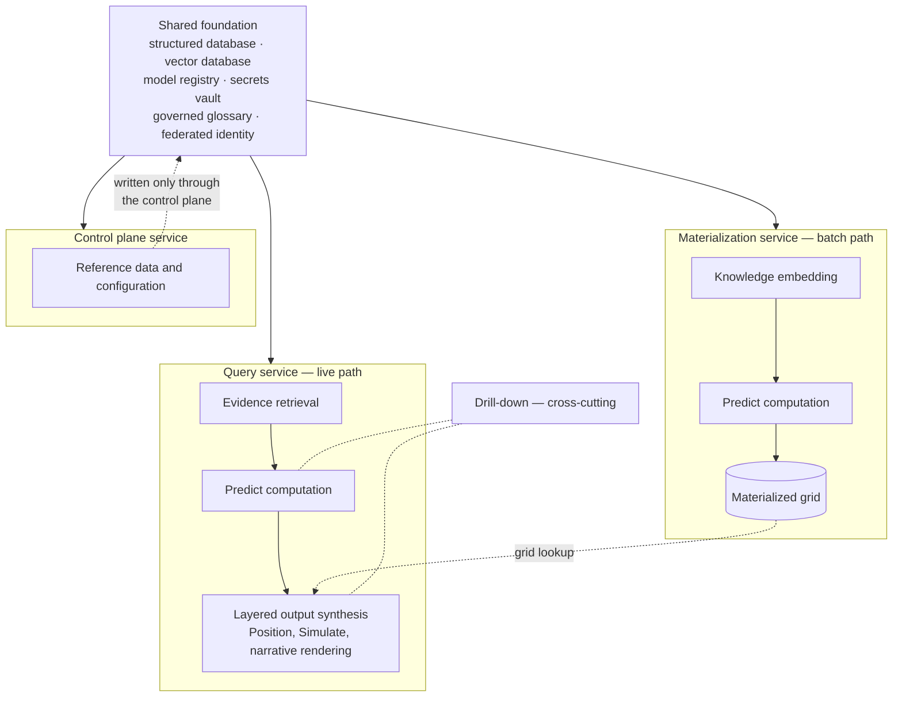
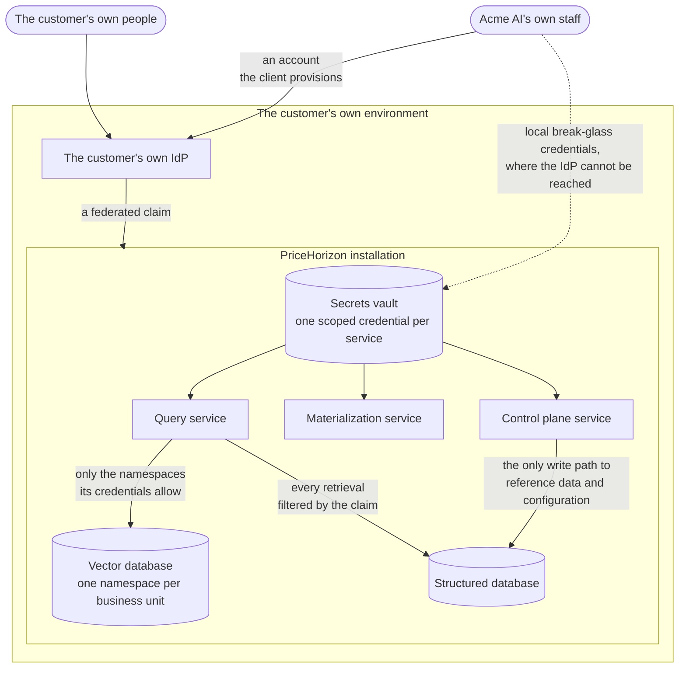
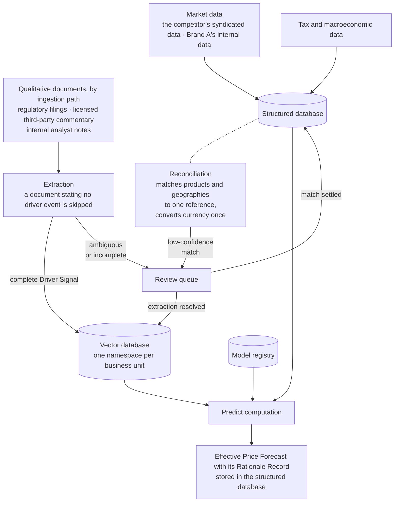
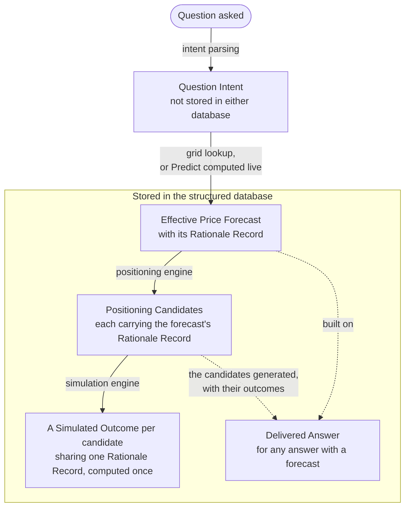
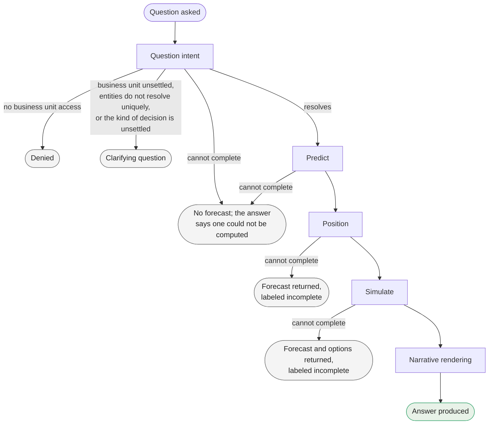

## Architecture Overview

PriceHorizon is a versioned, self-hosted installation inside each customer's own environment, and that topology is the primary security control: a customer's data stays inside their own infrastructure by construction, with no shared store spanning customers for it to leak through. Access control and audit logging are a governed second layer on top of that decision, not a substitute for it. Within an installation, the architecture is a shared foundation, computational layers built on top of it, and services that run those layers.

The foundation is common to every service: one harmonized structured database (syndicated retail data, POS history, elasticity models, tax and macroeconomic data) alongside one vector database (the qualitative corpus, chunked and embedded), a versioned registry of every callable model and weighting rubric, a secrets vault issuing one scoped credential per service, a governed business glossary every question resolves against before anything computes, and identity federated from the customer's own IdP, which the customer's own people sign in through and which sits inside the customer's own environment, with Acme AI's own staff signing in through an account the client provisions in that same IdP or, only where it cannot be reached, through local break-glass credentials drawn from that same vault, so no path needs a connection outside the customer's environment. Because every question resolves against that glossary, the language model reasoning over a question never computes a number itself: it calls versioned models and cites retrieved facts.

The layers run on that foundation. Knowledge embedding happens before any question is asked: qualitative documents are extracted into driver signals, and competitor and Brand A catalogs are reconciled to a common product and geography reference. The batch path also computes and stores, from that knowledge and the competitor's own price history, an effective price forecast for every combination a business unit tracks, so most questions become a lookup rather than a live computation. Once a question is asked, the live path first retrieves the evidence that bears on it, then Predict computation turns that evidence into the forecast, the driver attribution behind it, and the confidence score attached to it, run across the whole grid on the batch path or live for anything the grid does not already cover, the identical computation either way, so a live answer and a materialized one never disagree over timing, and where a business unit's configuration changed between them, each records the configuration version it used (`specs/application/technical/engineering-and-production-considerations.md § Engineering and Production Considerations § Orchestration`). Layered output synthesis then produces the final answer, turning a Predict result into the full answer: a bounded, deterministic set of positioning options, chosen by the kind of decision the question is asked for, the Query user's session choice unless the question's own words say otherwise, each simulated for its business outcome, consolidated down to a real set of choices, and rendered into plain language on demand. Drill-down cuts across the stages, available at each rather than a step of its own, the same granularity, geography, or metric pivot applying whether what is being explored is Predict's forecast, Position's options, or Simulate's outcomes. Not every question reaches an answer: one from an asker with no business unit access at all is denied, one whose business unit neither the question nor the session settles, whose entities do not resolve uniquely, or whose kind of decision is unsettled, comes back as a clarifying question instead of a forecast, and past that point a stage that cannot complete returns what the earlier stages already produced, labeled as incomplete rather than quietly substituted for, or, where no stage completed, says that instead (`specs/application/product/trust-and-explainability/degraded-answer-behavior.md § Degraded Answer Behavior`).

The evidence those layers work from has named origins and one home for each kind. Market data, the competitor's syndicated data and Brand A's own internal data, lands in the structured database alongside tax and macroeconomic data, and reconciliation then matches the two market views there. Reconciliation is also where a price reported in a currency other than its geography's own is converted, once, at the rate captured with that data; every price after it stays in its geography's own currency and is never converted or combined across currencies. Qualitative documents arrive by ingestion path, the path setting whether a document is a regulatory filing, licensed third-party commentary, or an internal analyst note, and with it how credible it counts. Extraction reads each document first: one stating no event in any driver category is skipped, and only a complete Driver Signal is stored, in its business unit's own namespace of the vector database. Of what goes to the review queue described below, an extraction is stored only once resolved, and a low-confidence match is used only once settled. A figure a reviewer supplies or corrects takes the credibility of the document that states it, or of an internal analyst note where it comes from the reviewer's own knowledge. Predict computation reads both stores and the model registry. `§ Architecture Overview § Diagrams § From Evidence to Answer` below pictures this.

Predict computation builds each forecast the same way, on the batch path or live. Each Driver Signal goes, by its event type, to exactly one consumer, so no signal is counted twice: the competitor's announced price change, or a change to its promotional calendar, adjusts the baseline, its own price trend, seasonality and promotional cadence carried forward; every other signal goes to driver attribution, which sizes each driver's correction from that driver's weight in a versioned rubric and from its routed signals' magnitudes, or, for elasticity, a registered model's estimate, and for competitor plans, a registered model's translation of the signal it was given. The forecast's move is exactly the baseline move plus those corrections. Triangulation selects the signals routed to driver attribution that take effect inside the horizon; one pushing price in a direction the baseline does not show, by enough to count as a move on its own, still counts in its driver's correction, and is also flagged as a conflict, recorded and shown rather than averaged away silently. The confidence score weighs how credible the weakest source is, how current the data is, and whether a conflict was found, and a conflict also caps it, however strong the rest; the confidence band around the forecast comes from its forecasting models alone.

An answer is a set of records. Intent parsing turns a question into a Question Intent, which is not stored in either database; the records after it are stored in the structured database. A grid lookup, or Predict computed live, yields an Effective Price Forecast carrying its Rationale Record, which is what its baseline, drivers and confidence open to; the positioning engine produces Positioning Candidates, each carrying that same Rationale Record; the simulation engine produces a Simulated Outcome per candidate, all sharing one Rationale Record computed once for the question. A Delivered Answer records any answer for which Predict produced a forecast, whether or not Position and Simulate complete: the forecast it was built on, the candidates generated with their outcomes, the kind of decision it was given for, and the versions and data it was produced against, so its positioning and simulation can be reproduced as the forecast can. `§ Architecture Overview § Diagrams § The Answer` below pictures this.

The services split along a different axis than the layers do. A query service runs the live path, request-driven and latency-sensitive. A materialization service runs the batch path, throughput-oriented and tolerant of long jobs: its forecasts nightly, whenever competitor data refreshes, and on demand for one business unit, and its document extraction as the corpus refreshes. A control plane service is separated for a security reason, not a workload one: it alone holds write access to reference data and configuration, so a vulnerability in the far larger, far more exposed query surface can never reach the capability to change what a competitor's code means or what a business unit's threshold is. It is also the client's own self-service surface: a Control plane admin tunes their own business unit there without Acme AI, while the forecasting mechanism itself stays with Acme AI; an Identity admin maps the customer's identity claims to business units and roles there; and it serves read-only views of the installation's pinned versions and audit retention. Across every service, the IdP-asserted claim is the enforcement boundary: the vector database is partitioned one namespace per business unit with credentials issued per namespace, so a bug in application code cannot reach a namespace its credentials were never issued for, and every structured retrieval is filtered by that same claim at the query level. `§ Architecture Overview § Diagrams § Trust Boundaries` below pictures this.

`§ Architecture Overview § Layer-to-Architecture Mapping` below is the row-by-row proof tying each piece of the product-facing answer to the mechanism above that actually produces it, with the full detail behind each mechanism cited from its own file.

`§ Architecture Overview § Diagrams § Layer Composition` below renders this composition, and `§ Architecture Overview § Diagrams § Orchestration State Machine` the shape of a question's path through it, for a reader who wants the picture before the proof.

### What Else These Services Run

Producing an answer is what the layers do; it is not all these services run.

The same batch path that materializes forecasts, on the same cadence, also looks back at them. Once a forecast's horizon has elapsed and real competitor data covers it, the materialization service computes how far the forecast was off and a verdict, Right, Right direction, or Wrong, judged against what the forecast recorded when it was made, and stores both as a separate, later-arriving record, never editing the original (`specs/application/technical/materialization-service/forecast-materialization.md § Realized outcome tracking`). The query service exposes every stored forecast with its evidence and, where its comparison with what happened has been computed, that comparison, as one read-only report, scoped by the asker's existing claim rather than by any new gating: a Control plane admin's own business unit, a Platform admin's escalated look at one, or every business unit an installation hosts. Run before any horizon has elapsed, that same report is the first health check after onboarding (`specs/application/technical/query-service/evidence-and-accuracy-reporting.md § Bulk Evidence and Accuracy Report`).

Distinct kinds of record are kept alongside the answer path, deliberately never folded together. An audit log of who did what is application data rather than telemetry: it is committed transactionally with the action it records, so an action and its record are never separated; retained for at least a year, a period a Platform admin can raise per a client's contractual requirement and no routine path can lower; read by the client on the control plane, each role the entries it may see, and exportable to someone with no access to the product, the export carrying the record of what happened but never the answer content it references. The application's own telemetry, its logs, traces and metrics of how a request executed, is the opposite in almost every respect: kept for weeks and carrying none of the protected content the answer path handles, no forecast values, no document content, no credential material, no raw IdP claims; a forwarding agent ships it either to whatever observability platform the client already runs or, where they run none, to a viewer shipped alongside PriceHorizon, and PriceHorizon needs no connection outside the client's environment to ship it, never sends it to anything Acme AI hosts, and never combines it with another customer's. An answer's own lineage, what produced one specific number, is neither, and lives on the Effective Price Forecast and Delivered Answer rows the answer is made of (`specs/application/technical/engineering-and-production-considerations.md § Engineering and Production Considerations § Security and governance`, `specs/application/technical/data-model.md § Core Data Model § Audit Log`).

Further mechanisms keep the design honest rather than serve a request. A golden-question harness runs in CI whenever a model, prompt template, or data pipeline version changes, asserting that the structural rules this specification declares, a Decision Table row, an Algorithm step, a Constraint, actually fire, each carrying at least one question written alongside it; it checks the declared rules, not whether a forecast came true, which is what the realized outcomes above are for (`specs/application/technical/evaluation-and-monitoring.md § Evaluation and monitoring`). And where the upstream work feeding the grid cannot resolve something confidently, a product match, or a document extraction that is ambiguous or incomplete, the item is flagged into a review queue for a Control plane admin rather than guessed at, before it ever reaches an answer (`specs/application/technical/data-model.md § Core Data Model § Pipeline and Answer Artifacts § Review Queue Item, a Lifecycle`).

The guarantees the product states, a repeatable answer, every number traced to a versioned source, qualitative context weighed in rather than appended afterward, and an answer that shows how it was built, together with the guardrail beneath them all, flagging uncertainty rather than guessing, are not another layer. Each is assembled from mechanisms already named above, and one file gathers how each is actually built (`specs/application/technical/guarantees-mechanics.md § How the Guarantees Are Achieved Mechanically`).

One REST API serves both the answer surface and the control plane, one authentication model and one set of client libraries for both, the separation between them being the service boundary above, not the API surface (`specs/application/technical/engineering-and-production-considerations.md § Engineering and Production Considerations`).

### Diagrams

#### Layer Composition

**Caption:** The foundation, the layers, and the services described above. Predict computation appears in more than one service because it is one layer run on different cadences, the axis on which layers and services genuinely differ.

**Sources:**
- `specs/application/technical/control-plane-service/control-plane.md § Control Plane`
- `specs/application/technical/data-model.md § Core Data Model § Harmonized quantitative foundation`
- `specs/application/technical/data-model.md § Core Data Model § Vector Database Schema`
- `specs/application/technical/engineering-and-production-considerations.md § Engineering and Production Considerations § Service boundaries`
- `specs/application/technical/glossary-and-grounding.md § Guaranteed grounding`
- `specs/application/technical/identity-and-access.md § Business unit access, federated`
- `specs/application/technical/materialization-service/forecast-materialization.md § Forecast materialization`
- `specs/application/technical/model-registry.md § Model registry`
- `specs/application/technical/predict-computation.md § Predict Computation`
- `specs/application/technical/query-service/intent-and-retrieval.md § Dynamic Retrieval and Weighting (when the question is asked) § Parallel evidence retrieval`
- `specs/application/technical/query-service/layered-output-synthesis.md § Layered Output Synthesis (producing the answer)`
- `specs/application/technical/query-service/layered-output-synthesis.md § Layered Output Synthesis (producing the answer) § Drill-down mechanics`
- `specs/application/technical/query-service/layered-output-synthesis.md § Layered Output Synthesis (producing the answer) § Narrative rendering`
- `specs/application/technical/query-service/layered-output-synthesis.md § Layered Output Synthesis (producing the answer) § Positioning engine`
- `specs/application/technical/query-service/layered-output-synthesis.md § Layered Output Synthesis (producing the answer) § Simulation engine`
- `specs/application/technical/secrets-management.md § Secrets management`
- `§ Architecture Overview`

#### Trust Boundaries

**Caption:** The boundaries that keep each customer's data and configuration safe: the installation, and the customer's own IdP beside it, inside the customer's own environment, so signing in needs no connection outside it; a federated claim from the customer's own IdP, the enforcement boundary at every service, which the customer's own people and Acme AI's own staff both reach through accounts the client provisions; local break-glass credentials in the vault, drawn dotted, only where that IdP cannot be reached; the vault issuing each service its own credential; the vector database reachable only through each namespace's own credentials; every structured retrieval filtered by the claim; and the control plane as the only write path to reference data and configuration.

**Sources:**
- `specs/application/technical/data-model.md § Core Data Model § Harmonized quantitative foundation`
- `specs/application/technical/engineering-and-production-considerations.md § Engineering and Production Considerations § Security and governance`
- `specs/application/technical/engineering-and-production-considerations.md § Engineering and Production Considerations § Service boundaries`
- `specs/application/technical/identity-and-access.md § Business unit access, federated`
- `specs/application/technical/identity-and-access.md § Platform admin access`
- `specs/application/technical/query-service/intent-and-retrieval.md § Dynamic Retrieval and Weighting (when the question is asked) § Intent parsing and decoupling`
- `specs/application/technical/secrets-management.md § Secrets management`
- `§ Architecture Overview`

#### From Evidence to Answer

**Caption:** Where evidence comes from, what keeps unhelpful or incomplete evidence out of a forecast, where each kind is stored, and the forecast record its baseline, drivers and confidence open to.

**Sources:**
- `specs/application/technical/data-model.md § Core Data Model § Harmonized quantitative foundation`
- `specs/application/technical/data-model.md § Core Data Model § Pipeline and Answer Artifacts § Effective Price Forecast`
- `specs/application/technical/data-model.md § Core Data Model § Pipeline and Answer Artifacts § Product and Geography Match`
- `specs/application/technical/data-model.md § Core Data Model § Pipeline and Answer Artifacts § Rationale Record`
- `specs/application/technical/data-model.md § Core Data Model § Pipeline and Answer Artifacts § Review Queue Item, a Lifecycle`
- `specs/application/technical/data-model.md § Core Data Model § Vector Database Schema`
- `specs/application/technical/data-model.md § Core Data Model § Vector Database Schema § Driver Signal`
- `specs/application/technical/materialization-service/driver-signal-extraction.md § Vector and semantic mapping, with structured extraction`
- `specs/application/technical/materialization-service/reconciliation.md § Product and Geography Reconciliation`
- `specs/application/technical/materialization-service/reconciliation.md § Product and Geography Reconciliation § Currency normalization`
- `specs/application/technical/model-registry.md § Model registry`
- `specs/application/technical/predict-computation.md § Predict Computation`

#### The Answer

**Caption:** The records an answer is made of: which stage produces each, which are stored, and what a Delivered Answer records for any answer for which Predict produced a forecast, whether or not Position and Simulate complete.

**Sources:**
- `specs/application/technical/data-model.md § Core Data Model § Harmonized quantitative foundation`
- `specs/application/technical/data-model.md § Core Data Model § Pipeline and Answer Artifacts § Delivered Answer`
- `specs/application/technical/data-model.md § Core Data Model § Pipeline and Answer Artifacts § Effective Price Forecast`
- `specs/application/technical/data-model.md § Core Data Model § Pipeline and Answer Artifacts § Positioning Candidate`
- `specs/application/technical/data-model.md § Core Data Model § Pipeline and Answer Artifacts § Question Intent`
- `specs/application/technical/data-model.md § Core Data Model § Pipeline and Answer Artifacts § Rationale Record`
- `specs/application/technical/data-model.md § Core Data Model § Pipeline and Answer Artifacts § Simulated Outcome`
- `specs/application/technical/materialization-service/forecast-materialization.md § Forecast materialization`
- `specs/application/technical/predict-computation.md § Predict Computation`
- `specs/application/technical/query-service/intent-and-retrieval.md § Dynamic Retrieval and Weighting (when the question is asked) § Intent parsing and decoupling`
- `specs/application/technical/query-service/layered-output-synthesis.md § Layered Output Synthesis (producing the answer) § Confidence and rationale packaging, extended`
- `specs/application/technical/query-service/layered-output-synthesis.md § Layered Output Synthesis (producing the answer) § Positioning engine`
- `specs/application/technical/query-service/layered-output-synthesis.md § Layered Output Synthesis (producing the answer) § Simulation engine`

#### Orchestration State Machine

**Caption:** The orchestration State Machine, collapsed to this file's own altitude: each stage's internal states go unnamed here, as this file's prose leaves them, the full breakdown staying in its States and Transitions tables.

**Sources:**
- `specs/application/technical/engineering-and-production-considerations.md § Engineering and Production Considerations § Orchestration`

### Layer-to-Architecture Mapping

The seam between this file and the product's own Answer Engine domain (`specs/application/product/answer-engine/predict.md § Predict — what will the competitor do`, `specs/application/product/answer-engine/position.md § Position — where Brand A should sit`, `specs/application/product/answer-engine/simulate.md § Simulate — what follows for the business`, `specs/application/product/answer-engine/drill-down.md § Drill-down — cross-cutting, available at every stage`, `specs/application/product/answer-engine/decision-context.md § Decision Context`). Every product-facing layer traces to one mechanism here; nothing in the answer experience exists without a corresponding piece of this architecture. Predict's layers are typically served from the `specs/application/technical/materialization-service/forecast-materialization.md § Forecast materialization` materialized grid; the live `specs/application/technical/predict-computation.md § Predict Computation` mechanism is the fallback when a query falls outside it.

| Product layer | Stage | Technical mechanism |
|---|---|---|
| Scorecard / heatmap | Predict | Forecast materialization (`specs/application/technical/materialization-service/forecast-materialization.md § Forecast materialization`), or, outside the grid, the same Predict computation run live (`specs/application/technical/predict-computation.md § Predict Computation`); Brand A's current price is retrieved (`specs/application/technical/query-service/intent-and-retrieval.md § Dynamic Retrieval and Weighting (when the question is asked) § Parallel evidence retrieval`), not modeled |
| Plain-language narrative | Predict | Narrative rendering (`specs/application/technical/query-service/layered-output-synthesis.md § Layered Output Synthesis (producing the answer) § Narrative rendering`), generated live from the rationale record, constrained to its fields, not precomputed or stored |
| Geographic visualization | Predict | Materialized grid (`specs/application/technical/materialization-service/forecast-materialization.md § Forecast materialization`) rendered directly as a map (`specs/application/technical/query-service/layered-output-synthesis.md § Layered Output Synthesis (producing the answer)`); allocation below the grid's native geography (`specs/application/technical/query-service/layered-output-synthesis.md § Layered Output Synthesis (producing the answer) § Drill-down mechanics`) |
| Decomposition graph | Predict | Driver Attribution contribution breakdown (`specs/application/technical/predict-computation.md § Predict Computation § Driver Attribution`), rendered as a driver chart, alongside the baseline and its evidence (`specs/application/technical/data-model.md § Core Data Model § Pipeline and Answer Artifacts § Rationale Record`); not available below the materialized grid's geography, where no causal signal was computed |
| Evidence view, per driver | Predict | driver_evidence in the Rationale Record (`specs/application/technical/data-model.md § Core Data Model § Pipeline and Answer Artifacts § Rationale Record`), populated during Driver Attribution (`specs/application/technical/predict-computation.md § Predict Computation § Driver Attribution`) from the same Driver Signal or model source the computation actually used |
| Confidence, per reason | Predict, Position, Simulate | `confidence_components` and `conflicts` in the Rationale Record (`specs/application/technical/data-model.md § Core Data Model § Pipeline and Answer Artifacts § Rationale Record`), written by `specs/application/technical/predict-computation.md § Predict Computation § Confidence and rationale packaging` for Predict and Position, and by `specs/application/technical/query-service/layered-output-synthesis.md § Layered Output Synthesis (producing the answer) § Confidence and rationale packaging, extended` for a Simulated Outcome, whose record carries no `conflicts` |
| Options frame | Position | Positioning engine (`specs/application/technical/query-service/layered-output-synthesis.md § Layered Output Synthesis (producing the answer) § Positioning engine`): fixed archetype rules applied to the Predict output and seeded by decision type, not an optimizer, the engine also taking Brand A's current price, margin targets and elasticity model, its candidates consolidated after simulation (`specs/application/technical/query-service/layered-output-synthesis.md § Layered Output Synthesis (producing the answer) § Option Consolidation`) |
| Outcome comparison | Simulate | Simulation engine (`specs/application/technical/query-service/layered-output-synthesis.md § Layered Output Synthesis (producing the answer) § Simulation engine`): share, volume, and margin models run once per candidate; category growth aggregated from those outputs, revenue calculated directly as price times volume |
| Drill-down — granularity, within the grid | All | Question Intent re-executed at narrower geographic scope inside the materialized grid, same model versions and weights (`specs/application/technical/query-service/layered-output-synthesis.md § Layered Output Synthesis (producing the answer) § Drill-down mechanics`) |
| Drill-down — granularity, below the grid | All | Allocation of the same figure at the nearest grounded geography above it, by population or retail-footprint weighting, distinct confidence tier; decomposition graph unavailable, not inherited or recomputed (`specs/application/technical/query-service/layered-output-synthesis.md § Layered Output Synthesis (producing the answer) § Drill-down mechanics`) |
| Drill-down — metric pivot | All | Existing output re-projected onto a different metric field; new model call only if that metric was not already computed (`specs/application/technical/query-service/layered-output-synthesis.md § Layered Output Synthesis (producing the answer) § Drill-down mechanics`) |
| Decision context shown with every answer | All | Session context (`specs/application/technical/query-service/intent-and-retrieval.md § Dynamic Retrieval and Weighting (when the question is asked) § Session context`), carried on each question request; intent parsing settles the business unit and kind of decision each question is given for, its own words over the session's (`specs/application/technical/query-service/intent-and-retrieval.md § Dynamic Retrieval and Weighting (when the question is asked) § Intent parsing and decoupling`); every answer returns both, and the kind of decision seeds the positioning engine (`specs/application/technical/query-service/layered-output-synthesis.md § Layered Output Synthesis (producing the answer) § Positioning engine`) |
